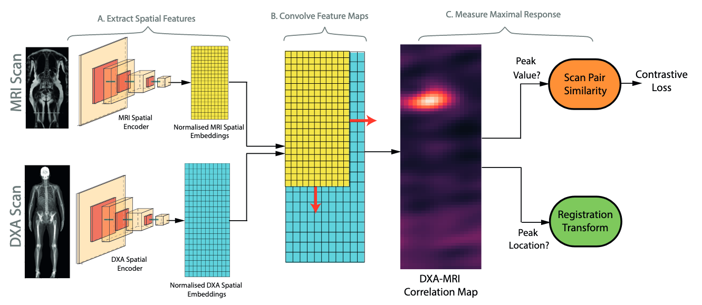

# Representation Learning for Whole Body Biobank Scans


This repository contains code for the experiments detailed in 'Self-Supervised Multi-Modal Alignment For Whole Body Medical Imaging' (see arxiv [here](https://arxiv.org/abs/2107.06652)). 
This uses data from the UK Biobank ([register here](https://www.ukbiobank.ac.uk/enable-your-research/register)). For details on downloading and preprocessing the UK Biobank, please view [this repository](https://github.com/rwindsor1/UKBiobankDXAMRIPreprocessing).

You are welcome to use this code either to reproduce the results of our experiments or for your own research. 
However, if you do, please cite the following:

Windsor, R., Jamaludin, A., Kadir, T. ,Zisserman, A. "Self-Supervised Multi-Modal Alignment For Whole Body Medical Imaging" 
In: Proceedings of 24th International Conference on Medical Image Computing and Computer Assisted Intervention (MICCAI) 2021

bibtex:
```
@inproceedings{Windsor21SelfSupervisedAlignment,
  author    = {Rhydian Windsor and
               Amir Jamaludin and
               Timor Kadir and
               Andrew Zisserman},
  title     = {Self-Supervised Multi-Modal Alignment for Whole Body Medical Imaging},
  booktitle = {MICCAI},
  year      = {2021}
}
```

# To run this code

To train the contrastive networks used in this experiment, run the following command

`python train_contrastive_networks.py with BATCH_SIZE=20`

For the dataset using in this experiment, we found it took approximately 100 epochs to converge.

To view the results of the registration methods please see the notebook at `notebooks/demonstrate_registrations.ipynb`.


## To be added

- [x] Dataset preprocessing code (see [this repo](https://github.com/rwindsor1/UKBiobankDXAMRIPreprocessing))
- [x] Contrastive networks training and evaluation code
- [x] Correspondance-matching registration methods
- [ ] Regressor Network training and evaluation code
- [ ] Cross modal segmentation
- [ ] Option to train with larger models + at higher spatial embedding resolutions


## Libraries Used
- Code is tested using python 3.7
- This deep learning aspect of this project is implemented in vanilla pytorch (v.1.7). 
- Experiment logging is done using [sacred](https://sacred.readthedocs.io/en/stable/quickstart.html)(v.0.8.2). 
- For visualisation of results [omniboard](https://github.com/vivekratnavel/omniboard) is recommended.
# Changes from paper

As we used raw DXA scans from the Biobank as opposed to those that can downloaded, the code requires some
adaption to work with the publically available data. These changes are itemised below:

- The size of DXA scans fed to the network is changed to (1000,300) as opposed to (800,300) used in the paper. This slightly increases batch GPU usage but ensures the entire body is shown in the image for more patients. 

- The size of MRI scans are changed from  (501 ×224) to (700,224) for similar reasons.

- We train with a batch size of 20 as this is found to slightly improve performance.

- Instead of synthesising a coronal slice which follows the plane of the spine using SpineNet, we select the coronal
  slice from the scan using a heuristic described in https://github.com/rwindsor1/UKBiobankDXAMRIPreprocessing.
  
- We add an additional augmentation using training which selects nearby slices to the mid-coronal slice instead of
  the mid-coronal slice itself.


